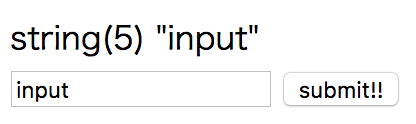
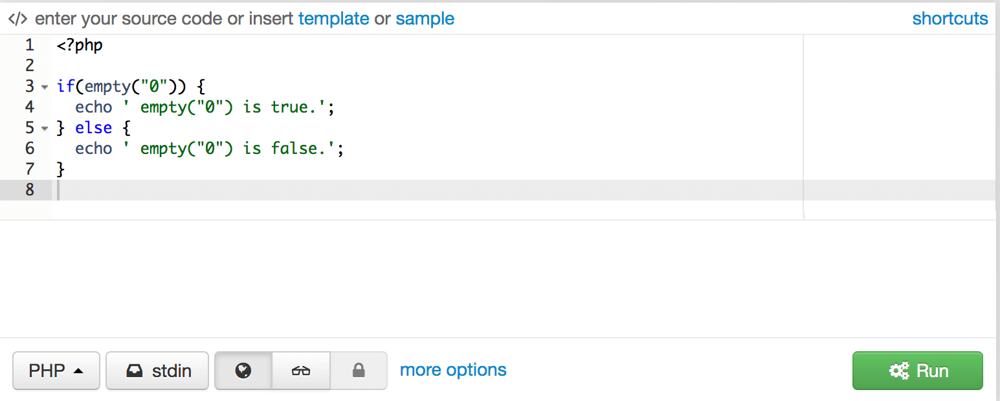
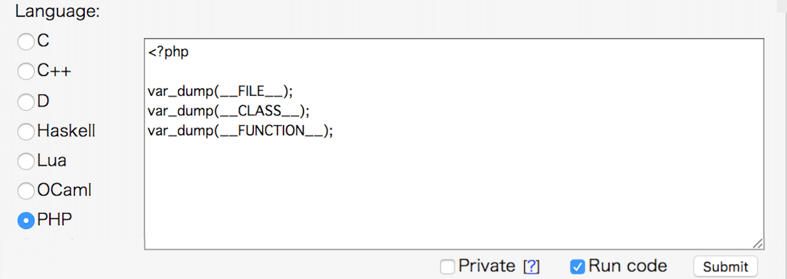

### お手軽に使う PHP

　
　  
　  
　　　　id:kakisoft

---
### 自己紹介

<div class="left">

</div>

<div class="right">
  <table style="white-space: nowrap;border-style: none;">
    <tr>
      <td>@size[0.75em](**名前**)</td>
      <td>
        <ruby>
        <rb>@size[0.95em](垣花　暁)</rb>
        <rp>（</rp>
        <rt>かきのはな　さとる</rt>
        <rp>）</rp>
        </ruby>
        　@fa[twitter fa-0.3x][@size[0.7em](kakisoft_tab)](https://twitter.com/kakisoft_tab)
      </td>
    </tr>
    <tr>
      <td>@size[0.75em](**出身**)</td>
      <td>@size[0.95em](沖縄県)</td>
    </tr>
    <tr>
      <td>@size[0.75em](**仕事**)</td>
      <td>@size[0.95em](物流系エンジニア) @size[0.7em](（フリーランス）)</td>
    </tr>
    <tr>
      <td>@size[0.75em](**使う**)</td>
      <td>@size[0.95em](.NET/Java/PHP/RDB全般)</td>
    </tr>
    <tr>
      <td>&nbsp;</td>
      <td>@size[0.95em](物流業界向けの言語や機器)</td>
    </tr>
    <tr>
      <td>@size[0.75em](**趣味**)</td>
      <td>@size[0.95em](リアル脱出ゲーム)</td>
    </tr>
  </table>
</div>
---
PHPを使い始める時の環境って、  
どんな感じなのでしょう？
---
次のような感じが  
多いんじゃないかと思ってます。
---
 * 社内で整備した環境  
 （シェルスクリプト/Chef/Ansible で用意）
 * 公式の仮装環境（Vagrant/Docker）
 * カスタマイズした仮装環境（同）
---
ゼロから始める場合、仮装環境は、  
特定フレームワークの公式イメージや  
ボックスをベースにする事が  
多いんじゃないかと思います。
---
既に稼動中のプロダクトに
途中から参画する場合、
動作に必要なアプリ、パッケージ、ミドルウェアが  
用意されている事が多いんじゃないかと思います。
---
そんな感じで、  
　  
「PHPを軽く使う」  
　  
という状況が、生まれにくく  
なっているんじゃないかと思いました。
---
というわけで、  
プロダクトでがっつり使う事は  
とりあえず置いといて、  
PHPをお手軽に使う方法について  
スポットを当ててみました。
---
### コンソール
---
ファイル：「 console.php 」
```php
<?php
$message = "Hello World";

echo $message;
```

コンソールより実行。
```
$ php console.php
Hello World
```
---
### ビルトインサーバ
---
ApacheやNginxといった  
Webサーバを用意せず、
PHP付属の物を使う。
---
```
＜起動＞
php -S localhost:8000

＜終了＞
Ctrl + C
```
　  
以下のように起動すると、外部からアクセスできる。
```
＜起動（外部からアクセス可）＞
php -S 0.0.0.0:8000
```
---
##### 例
ファイル名：「buildinserver.php」
```php
<?php var_dump($_POST["textbox01"]); ?>
<!DOCTYPE html>
<html lang="ja"><head><meta charset="utf-8"></head>
<body>
  <form action="" method="POST">
    <input type="text" name="textbox01" value="<?php echo $_POST["textbox01"]?>">
    <input type="submit" value="submit!!">
  </form>
</body>
</html>
```
```
php -S localhost:8000
```
```
http://localhost:8000/buildinserver.php
```
---
実行結果、こんな感じ。  

---
### 対話形式
---
コンソールにて ``` php -a ``` を入力すると、  
対話形式で実行できる。
```
$ php -a
Interactive shell

php > echo "hello";
hello
```

PHP 5.1.0 以降で使用可。  
タブ補完が効く。  
---
### ブラウザから使用１
### Ideone
---
Ideone というサービスにて、  
ブラウザに PHPのコードを入力して実行できる。  
https://ideone.com/
　  　    

　
速度はあんまり早くない。
---
### ブラウザから使用２
### codepad
---
codepad というサービスにて、  
ブラウザに PHPのコードを入力して実行できる。  
http://codepad.org/
　  　    

　
結構サクサク動く。ローカルにPHPが  
入ってない場合は、いいかもしんない。
---
こんな感じで、お手軽にPHP使う事もできます。
---
大規模開発からちょっと離れて、  
軽く触れてみるのもいいかもしれません。
---
おわり
